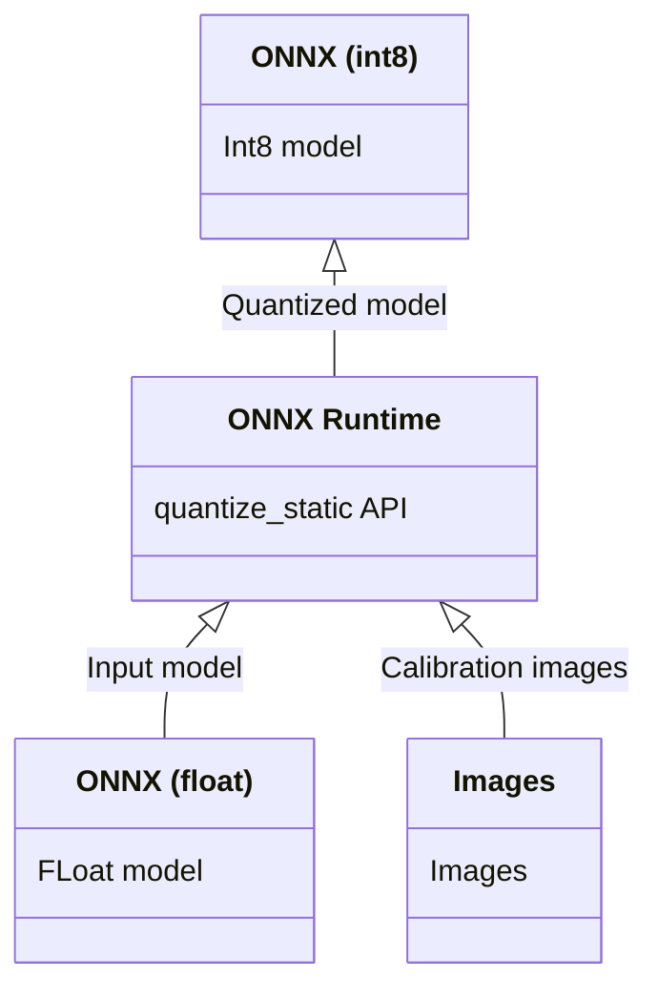

# onnx-quantization

This is a example to quantize onnx. The input is onnx of float. Quantization is done using onnxruntime. The output is onnx of int8.

## Architecture



## Calibration images

Place imagenet validation images in the imagenet_val folder to improve quantization accuracy. The default is to quantize using only 2 images, which is less accurate.

## Quantization command

Quantization can be performed with the following command. 

MobileNetV2

```
python3 quantize.py --input_model ./models/mobilenetv2_1.0.opt.onnx --output_model ./models/mobilenet_quantized.onnx --calibrate_dataset imagenet_val --per_channel True
```

YOLOX Tiny

```
python3 quantize.py --input_model ./models/yolox_tiny.opt.onnx --output_model ./models/yolox_tiny_quantized.onnx --calibrate_dataset imagenet_val
```

## Test

Inference using quantized yolox can be executed with the following command.

```
cd test
python3 yolox.py
```

## Output

- [yolox_tiny_quantized.onnx](yolox_tiny_quantized.onnx)
- [mobilenev2_quantized.onnx](mobilenev2_quantized.onnx)

## Limitation

Per-Channel support with QDQ format requires onnx opset version 13 or above.

## Reference

Official sample
https://onnxruntime.ai/docs/performance/quantization.html

Official document
https://github.com/microsoft/onnxruntime-inference-examples/tree/main/quantization/image_classification/cpu
